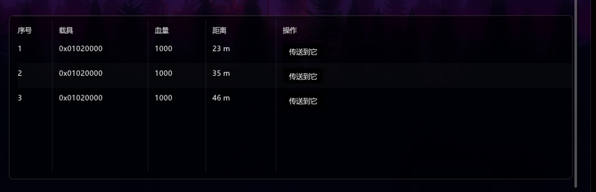

<div align="center">

# GTA5 DMA Control Console

[](https://github.com/fmc999/GTA5-DMA-CHEAT)
[](https://isocpp.org/)
[](https://github.com/ocornut/imgui)
[](https://github.com/ufrisk/MemProcFS)
[](https://github.com/fmc999/GTA5-DMA-CHEAT/actions/workflows/msbuild.yml)
[](LICENSE)
[](https://github.com/fmc999/GTA5-DMA-CHEAT/releases/latest)

基于 C++23 / Dear ImGui / DirectX 11 / MemProcFS 构建的 GTA5 DMA 外部控制台，暗色玻璃拟态悬浮面板界面，支持 GTA5 原版与 GTA5 Enhanced 双进程自动识别。

A GTA5 external DMA control console built with C++23 / Dear ImGui / DirectX 11 / MemProcFS — a dark glass-morphism floating panel UI, with automatic detection of both legacy GTA5 and GTA5 Enhanced.

**免费发布 · 请勿贩卖 · 仅供技术研究与 DMA 读写学习**
**Free release · Do not resell · For technical research and DMA read/write learning only**

</div>

---

## 界面预览 | Screenshots


悬浮玻璃面板：页眉品牌与状态胶囊（DMA / 进程 / 主机热键 / FPS）、左侧导航（人物控制 / 载具编辑 / 武器功能 / 战局玩家 / 位置传送 / 系统设置）、右侧工作区分组卡片、底部状态栏实时显示 PID / 基址 / 模型哈希与热键提示。面板可拖动与缩放，几何与外观写入 `window.ini`；面板以外区域保持纯黑。

Floating glass panel: header brand and status pills (DMA / process / host hotkeys / FPS), left navigation, grouped workspace cards, and a status bar with live PID / base address / model hash plus hotkey hints. The panel is draggable and resizable, with geometry and appearance persisted to `window.ini`, and everything outside the panel stays pure black.



战局载具表格：车名（24 款常用车型映射）/ 血量 / 距离，右侧「传送到它」把玩家直接送到该载具旁（错开 2 米防卡模）。

Session-vehicle table: model name (24 common models mapped) / health / distance, with a one-click **teleport-to-vehicle** button that sends the player next to that vehicle (offset by 2 m to avoid clipping).

## 功能 | Features

### 动态偏移解析 | Dynamic Offset Resolution ⭐
- 启动时特征码扫描 `.text` 段自动解析全部关键指针（10 条签名），游戏更新免改代码
- 主/备双特征码链，单条失配自动回退；失败时回落静态偏移表
- Runtime signature scanning of the `.text` section resolves all key pointers (10 signatures) at startup — no code changes needed after game updates, with primary/backup signature chains and static-offset fallback.

### 战局玩家 | Session Players ⭐
- YimMenuV2 加密 Ped 池扫描（`PoolEncryption` + rotl64 解密 → `fwBasePool` 迭代）
- 实时显示：名称 / RID / 等级 / 金钱 / RP / K/D / 血量 / 护甲 / 距离 / 载具状态 / 无敌 / 通缉
- 操作：传送到玩家（我 → 他）、拉到我这里（他 → 我）、击杀（血量清零），两种传送都错开 2 米防卡模，页面显示最近一次落点与读回校验
- 玩家加入/离开通知（默认关闭，设置页可开）；名字搜索过滤
- YimMenuV2 encrypted ped-pool scanning (`PoolEncryption` + rotl64 decrypt → `fwBasePool` iteration), live per-player name / RID / rank / money / RP / K-D / health / armor / distance / in-vehicle / god / wanted, teleport-to-player and kill actions, join/leave notifications (default off) and a name search filter.

### 战局载具 | Session Vehicles ⭐
- YimMenuV2 载具池（`fwVehiclePool`）实时扫描，50 米半径过滤
- 车名（24 款常用车型映射）/ 血量 / 距离；一键传送到它（把玩家直接送到该载具旁，错开 2 米防卡模）
- Live `fwVehiclePool` scanning with a 50 m radius filter; model name (24 common models mapped), health, distance; one-click teleport-to-vehicle (sends the player next to that vehicle, offset by 2 m to avoid clipping).

### 人物控制 | Player
- 玩家无敌与载具无敌（持续状态保护）
- 永不通缉、自动生命恢复、自动防弹衣刷新
- 隐身、无碰撞、速度控制（含野兽模式）
- 生命值 / 防弹衣锁定
- Player & vehicle god mode, never-wanted, auto health/armor refresh, invisibility, no-collision, speed control, health/armor locking.

### 载具编辑 | Vehicle Editor
- 载具 / 引擎 / 车身 / 油箱健康读取与修改
- 操控数据（加速、刹车、牵引、悬浮等）实时编辑
- 附加能力、降落伞、喷气、跳跃恢复
- 导弹锁定范围与有效距离、安全带
- **Tunable 体系（进度与解锁）**：脚本 tunable（`TUNABLE_BASE_ADDRESS = 0x40001` 起的全局单元）支持动态定位（候选绝对位置 + 四连组校验；单值邻域搜索已移除）+ 默认值体检后纯 DMA 读写 —— 已有 RP 倍率（`XP_MULTIPLIER`）、改外貌免冷却/免费（`CHARACTER_APPEARANCE_*`）、防挂机踢出（`IDLEKICK_*` / `ConstrainedKick_*`）；页面「进度与解锁」右侧常显 tunable 实读值，一眼核对定位是否正确
- 载具修复：一键写满四段健康值（载具 / 车身 / 油箱 / 引擎，各 1000）并逐字段读回校验；可只修当前载具，也可一键修 50 米内全部战局载具，血量低于 80% 时自动修复（带 1.5 秒节流）
- Vehicle / engine / body / tank health read & write, live handling-data editing, extras, parachute / jet / jump restore, missile lock range, seatbelt.

### 经济与自动化 | Economy & Automation
- **产业保险箱一键领取**：7 个产业（夜总会 / 游戏厅 / 事务所 / 车场 / 保释所 / 服装厂 / 洗车行）逐个写各自的动作格，触发即领取；支持周期自动领取（默认 30 秒）
- **静音来电**：读「来电状态 / 通话中 / 来电」三个格，条件成立时把状态写成 6（静音）；可作为常开自动化
- **GTA+ 解锁**：写 `GTA_PLUS_ENABLED` / 权益位 + 引擎侧 `HasGTAPlus` 标志，关闭开关或退出时还原
- **脚本线程（只读自检）**：枚举 `rage::scrThread`（名字 / hash / 栈基址）—— 供脚本 locals 读写通道使用（赌场老虎机、保险箱密码这类）
- 写入安全：所有动作格都带**合法值区间体检**（读到区间外的值即判「未定位」，绝不写入）、写后读回校验、脉冲动作 1.5 秒自动还原
- Safe-earnings claim for 7 businesses, phone-call silencer, GTA+ unlock, and a read-only script-thread inspector; every write is range-validated before it happens.

- **抢劫与经济价值（金额类）**：佩里克岛主目标价值（龙舌兰 400000 / 珍珠项链 560000 / 不记名债券 616000 / 粉钻 910000 / Madrazo 文件 1100000 / 蓝宝石黑豹雕像 1900000，实机读值）与跳伞挑战奖励（2000/2000/1000）支持「原值 × 倍率（1~10×）」写入，关闭即还原；这类条目用**区间体检**而不是固定默认值
- **诊断落盘**：启动自动写 `<exe 目录>\GTA5_DMA_diag.txt`，`--diag [路径]` 或 UI 按钮可随时导出 —— 内容含已解析偏移、20 条 tunable 的定位方式与实读值、12 个全局动作格、脚本线程清单、tunable 块可读范围探测。设备独占（工具常驻时外部进程拿不到），所以诊断只能由运行中的实例自己落盘

### 长期可用（游戏更新后不必重编译）| Long-lived without rebuilds

数据分三类，处理方式不同：

| 类别 | 例子 | 更新后 | 机制 |
|---|---|---|---|
| 寻址方式 | GlobalPtr / LocalScriptsPtr / GTAPlusPtr 特征码 | 自动重解析 | 每条偏移内置 4 个备选特征码，逐条扫描 + 落点校验 |
| 运行时数据 | tunable 索引、脚本全局分块、线程名单与栈地址 | 每次启动重算 | 名字「joaat 哈希」稳定 → 查 tunables.bin；再兜底「值序列自发现」 |
| 编译期常量 | 结构体字段偏移（Reclass.h） | 大版本可能要改 | 全部经由体检/读回校验，不会写错地址 |

**免重编译的三条外部通道**（都在 exe 同目录，改文本即可，游戏更新后用）：

- `GTA5_DMA_tunables.txt` —— 手填「名字 = 索引」覆盖；也可写 `bin = <路径>` 指向别的 tunables.bin
- `GTA5_DMA_patterns.txt` —— 追加特征码（`GlobalPtr = 48 8B 0D ? ? ? ? | disp=3 insn=7`），内置候选全失配时用
- `GTA5_DMA_diag.txt` —— 每次启动自动写出的诊断报告：偏移解析到了什么、哪些条目未定位、为什么

**值序列自发现**（本项目的兜底机制）：一组已知值（如佩里克六个主目标价值 400000/560000/616000/910000/1100000/1900000）在 tunable 块里连续且唯一地出现 —— 即使索引整体挪走，也能反推出正确位置。实测：把索引故意写错成 0x40001，程序体检拒绝后靠唯一性找回 0x47392。

### 武器功能 | Weapons
- 当前武器属性读取（伤害 / 射速 / 射程 / 后坐力 / 精度）
- 无限弹药、无需装弹
- 冲击力修改、百万瞬击（子弹速度）
- Weapon stats readout (damage / fire rate / range / recoil / accuracy), infinite ammo, no-reload, impact and bullet-speed tuning.

### 位置传送 | Teleport
- 自定义坐标 + 55 个预设点位（8 组：通用 / 赌场金库 / 赌场前置 / 赌场任务 / 佩里克岛前置 / 佩里克岛别墅外 / 佩里克岛战利品 / 佩里克岛撤离）
- 重复点位按坐标 8 米就近自动合并为一个按钮，原名并入按钮标签（62 → 55）
- `F5` 传送到地图标记点 · `F6` 传送到任务点（Enhanced）
- 人物与载具状态自动处理（上车传送、高度修正）
- Custom coordinates plus 55 preset locations in 8 groups, with duplicates within 8 m merged into one button by coordinate (62 → 55); `F5` waypoint / `F6` objective teleport (Enhanced), with vehicle-in/out and height correction handled automatically.

### 界面与运行 | UI & Runtime
- 悬浮玻璃面板：拖动 / 右下角缩放（最小 1180×780）/ `window.ini` 几何记忆；面板外纯黑
- 壁纸编译进 exe（原图 + 预模糊副本），中文字形完整内嵌
- 设置页可切换明暗模式与强调色、收起侧边栏；操作有 Toast 反馈
- DMA 读写线程与 UI 线程分离，Scatter 批量读写降低 PCIe 带宽占用
- 主机及目标机双端热键检测
- A draggable / resizable floating glass panel (min 1180×780, geometry persisted to `window.ini`, pure black outside it); wallpaper (and a pre-blurred copy) plus full CJK glyph ranges embedded in the exe; light/dark mode, accent color and sidebar-collapse switches in Settings with toast feedback; separate DMA / UI threads with scatter batch reads to cut PCIe traffic; dual-end hotkeys (host + target).

## 环境要求 | Requirements

### 硬件 | Hardware
- DMA / FPGA 设备（如 35T / 75T 板卡）
- 目标机：运行 GTA5 / GTA5 Enhanced 的 Windows 主机
- 控制机：运行本工具的 Windows 主机
- A DMA / FPGA device (e.g. 35T / 75T boards), a target machine running GTA5 / GTA5 Enhanced, and a control machine running this tool.

### 开发环境 | Development
- Visual Studio 2022（或更高）+ Desktop development with C++ 工作负载 / *or newer, with the Desktop C++ workload*
- Windows SDK（10.0+）
- C++23 语言标准（工程已配置 / *already configured*）

> 仓库已内置 Dear ImGui 源码与 MemProcFS 头文件 / 导入库（`GTA5_DMA/MemProcFS/`）。
> Dear ImGui sources and MemProcFS headers / import libs are bundled (`GTA5_DMA/MemProcFS/`).

## 构建 | Build

<details>
<summary><b>命令行 | Command line</b></summary>

```powershell
MSBuild.exe GTA5_DMA\GTA5_DMA.sln /t:Build /p:Configuration=Release /p:Platform=x64
```

产物 | *Output*: `GTA5_DMA/x64/Release/GTA5_DMA.exe`

</details>

<details>
<summary><b>Visual Studio</b></summary>

1. 打开 `GTA5_DMA/GTA5_DMA.sln` / *Open the solution*
2. 配置 `Release` / `x64`
3. 生成解决方案 / *Build*

</details>

<details open>
<summary><b>GitHub Actions（自动构建 | CI build）</b></summary>

推送到 `main` 即自动触发 [MSBuild workflow](.github/workflows/msbuild.yml)，构建产物发布在 Actions Artifacts。

Pushing to `main` triggers the [MSBuild workflow](.github/workflows/msbuild.yml) automatically; artifacts are published under Actions Artifacts.

</details>

## 使用 | Usage

1. 确认 DMA 设备与 MemProcFS 驱动环境正常（`vmm.dll` / `leechcore.dll` 需与 exe 同目录或位于 `GTA5_DMA/MemProcFS/`）
2. 在目标主机启动 GTA5 或 GTA5 Enhanced
3. 在控制主机运行 `GTA5_DMA.exe`
4. 等待页眉状态胶囊显示 DMA 与游戏进程已连接
5. 通过左侧导航进入功能页面；拖动面板顶部空白区可移动，拖右下角手柄可缩放（几何记在 `%LOCALAPPDATA%\GTA5_DMA\window.ini`）
6. 设置页 → 外观：切换明暗模式与强调色；界面：收起侧边栏

*Ensure the DMA device and MemProcFS driver environment is ready (`vmm.dll` / `leechcore.dll` next to the exe). Start GTA5 / GTA5 Enhanced on the target machine, run `GTA5_DMA.exe` on the control machine, wait for the header pills to show DMA and game process connected, then navigate via the sidebar. Drag the panel's empty header area to move it and the bottom-right grip to resize (geometry persisted in `%LOCALAPPDATA%\GTA5_DMA\window.ini`); Settings → Appearance switches light/dark mode and accent color.*

### 快捷键 | Hotkeys

| 按键 | 功能 | Description |
| --- | --- | --- |
| `Insert` | 显示 / 隐藏控制台 | Show / hide the console |
| `F5` | 传送到地图标记点 | Teleport to map waypoint |
| `F6` | 传送到任务点（Enhanced） | Teleport to objective (Enhanced) |
| `End` | 退出程序 | Exit |

## 项目结构 | Project Structure

```text
GTA5_DMA/
├── GTA5_DMA.sln                # 解决方案
├── GTA5_DMA/
│   ├── Core/                   # DMA 核心：初始化、内存后端、偏移、结构、输入
│   │   ├── DMA.*               # DMA 生命周期与指针链刷新（Scatter 批量读）
│   │   ├── MemoryBackend.*     # VMMDLL 封装：Read/Write/ScatterBatch (RAII)
│   │   ├── Offsets.h           # GTA5 / Enhanced 双版本偏移表
│   │   ├── PatternScanner.*    # 特征码扫描（?/??/** 通配，rel32 解析）
│   │   ├── OffsetResolver.*    # 运行时偏移解析（主/备/外部追加特征码链）
│   │   ├── RuntimeTables.*     # 运行时表：名字/值 → 索引解析、特征码外部追加（免重编译通道）
│   │   ├── Diagnostics.*       # 诊断落盘（偏移 / tunable / 全局动作格 / 线程 / 块可读范围）
│   │   ├── Reclass.h           # ReClass.NET 导出的游戏结构定义
│   │   └── InputManager.*      # 目标机键盘状态读取（热键双端检测）
│   ├── Features/               # 功能模块（每个模块实现 OnDMAFrame()）
│   │   ├── GodMode / NoWanted / RefreshHealth / HealthManager / ArmorManager
│   │   ├── Invisibility / NoCollision / PlayerSpeed / Ragdoll
│   │   ├── PlayerList          # 战局玩家（加密 Ped 池 + 统计 + 操作）
│   │   ├── VehicleRepair       # 载具修复（当前载具 / 一键修复战局载具，纯 DMA 写健康值）
│   │   ├── Tunables / TunableTable  # 脚本 tunable 读写（RP 倍率 / 外貌 / 踢出计时）
│   │   ├── ProgressFeatures   # 进度类功能开关（RP 倍率、外貌免冷却/免费）
│   │   ├── ScriptGlobalsTable # 脚本全局动作格登记表（保险箱 / 电话 / GTA+，含合法值区间）
│   │   ├── ScriptGlobals      # 脚本全局安全写层（区间体检 + 写回校验 + 脉冲还原）
│   │   ├── ScriptThreads      # 脚本线程只读枚举（scrThread：名字/hash/栈基址）
│   │   ├── EconomyFeatures    # 经济与自动化（保险箱领取 / 静音来电 / GTA+）
│   │   ├── VehicleList         # 战局载具（载具池扫描 + 传送到它）
│   │   └── Teleport / VehicleEditor / WeaponInspector / Locations
│   ├── UI/                     # 界面层
│   │   ├── MyImGui.*           # DX11 + Win32 平台层（窗口 / 设备 / 主循环）
│   │   ├── ConsoleShell.*      # 悬浮面板布局：页眉 / 侧边导航 / 工作区 / 状态栏
│   │   ├── ConsoleTheme.*      # 玻璃主题、明暗与强调色 + 共享控件
│   │   ├── Backdrop.*          # 壁纸与预模糊副本绘制（面板内外分区）
│   │   ├── EmbeddedAssets.h    # 编译进 exe 的壁纸与字体数据
│   │   ├── AppFonts.h          # 字体加载（正文 / 粗体 / 品牌字）
│   │   ├── GlyphRanges.h       # 中文完整字形范围
│   │   ├── UiToast.*           # Toast 操作反馈通知
│   │   ├── WindowState.*       # 面板几何 / 外观 / 开关状态持久化
│   │   └── MenuManager.*       # 页面状态与各页面内容
│   ├── assets/                 # 壁纸原图、预模糊副本、品牌字体
│   ├── external/               # stb_image.h（壁纸解码）
│   ├── tools/                  # gen_embedded_assets.py / gen_glyph_ranges.py
│   └── Attic/                  # 已停用功能（源码保留，便于恢复）
│       ├── TimeControl / HeistDividend / PlayerChaser / Dev
│       └── LegacyPages.cpp     # 停用功能的页面 UI 存档
├── ImGui/                      # Dear ImGui 1.91.8 源码
├── MemProcFS/                  # VMMDLL 头文件与导入库
tests/                          # 契约测试（PowerShell）+ 基础设施测试（C++）
docs/                           # 设计文档与截图
```

## 架构 | Architecture

```text
main.cpp
 ├─ UI 线程 ─── MyImGui::OnFrame ─── ConsoleShell::Render ─── 各功能页面
 └─ DMA 线程 ── DMA::DMAThreadEntry
                ├─ ResolveRuntimeOffsets()  # 启动时特征码解析 10 条指针
                ├─ UpdateEssentials()       # Scatter 批量刷新指针链
                └─ 15 × Feature::OnDMAFrame()  # 各功能轮询读写
```

- **线程模型**：UI 与 DMA 读写完全分离，通过原子变量通信，无锁
- **内存访问**：统一走 `MemoryBackend`（VMMDLL 封装），关键路径使用 Scatter 批量读写
- **偏移管理**：启动时 `OffsetResolver` 特征码动态解析（主/备双链），失败回落 `Offsets.h` 静态双版本表
- **界面**：`ConsoleShell` 用 ImDrawList 直绘玻璃面板（外壳 / 内容盒 / 分隔线），`Backdrop` 负责壁纸分区绘制，页面内容由 `MenuManager` 提供
- **Threading**: UI and DMA threads are fully decoupled and communicate via atomics (lock-free). **Memory**: all access goes through `MemoryBackend` (VMMDLL wrapper) with scatter batches on hot paths. **Offsets**: resolved at startup by `OffsetResolver` (primary/backup signature chains) with static-table fallback. **UI**: `ConsoleShell` paints the glass panel directly with ImDrawList, `Backdrop` handles wallpaper partitioning, and page bodies come from `MenuManager`.

## 测试 | Tests

```powershell
# 契约测试（tests/*.ps1：UI 标签与排版、偏移解析确定性、各功能生命周期、tunable / 脚本全局 / 脚本线程 / 诊断）
Get-ChildItem tests/*.ps1 | ForEach-Object { powershell -File $_.FullName }

# 基础设施测试（PatternScanner / MemoryBackend / OffsetResolver 纯逻辑断言）
msbuild tests\DmaInfrastructureTests.vcxproj /p:Configuration=Debug /p:Platform=x64
tests\x64\Debug\DmaInfrastructureTests.exe
```

## 偏移维护 | Offset Maintenance

动态解析失败时（日志出现 `kept static`），优先更新特征码（`Core/OffsetResolver.cpp` 目录）：
- `WorldPtr` / `GlobalPtr` / `BlipPtr` / `PlayerMgrPtr` / `AimCPedPtr` / `PedPoolPtr` / `VehiclePoolPtr` 等 10 条
- **解析确定性与候选校验**：`GlobalPtr`（rage::scrGlobal 的 64 分块指针表）的候选必须通过「分块表体检」——非 0 分块 ≥ 8 个、且全部 16 字节对齐且可读 —— 才被采纳，否则回退静态表 `0x3ED15A8`；老版 GTA5.exe 的备用签名已从目录移除（它在 Enhanced 上会算出错误的全局块，导致防挂机踢出等依赖脚本全局的功能失效）。扫描缓冲的全零页（换出/未驻留，`ZEROPAD_ON_FAIL` 填充）会打印告警，失配时能分辨是「特征码失效」还是「页没读到」
- 人物、载具、武器结构字段（`Core/Reclass.h`）

修改偏移或结构后，先验证只读数据，再启用写入功能。

*If dynamic resolution fails (log shows `kept static`), update the signature catalog first (`Core/OffsetResolver.cpp`), then structure fields (`Core/Reclass.h`). Always verify read-only data before enabling write features.*

## 已知限制 | Known Limitations

- 时间控制、任务分红、追战局功能已停用（源码保留于 `Attic/`）
- 战局载具的「传送到它」把玩家送到目标载具旁（错开 2 米）；目标载具若正在移动，落点按读取瞬间的坐标计算，可能落在车后
- 面板以外区域刻意保持纯黑（融合器叠加用），不是渲染失败
- 无 BattlEye 主动绕过；Enhanced 在线模式行为不受本工具保证
- Time control / heist dividend / session chaser are retired (sources kept in `Attic/`). Teleport-to-vehicle sends the player next to the target vehicle with a 2 m offset; if that vehicle is moving, the landing spot uses the coordinates sampled at read time. The pure-black area outside the panel is intentional (for compositor overlays). No active BattlEye bypass; Enhanced online behavior is not guaranteed.

## 免责声明 | Disclaimer

- 本项目仅用于技术研究、软件开发与 DMA 读写学习
- 使用者应自行确认并遵守所在地区法律、游戏平台规则与服务条款
- 游戏更新后内存结构可能失效，错误偏移可能导致功能异常或目标进程崩溃
- 作者不对账号、硬件、数据或其他直接及间接损失负责

*This project is for technical research, software development, and DMA read/write learning only. Users are responsible for complying with local laws and platform terms of service. Game updates may invalidate memory layouts; incorrect offsets can cause crashes or misbehavior. The author is not liable for any account, hardware, data, direct or indirect losses.*

## 致谢 | Acknowledgements

- [MemProcFS](https://github.com/ufrisk/MemProcFS) — DMA 内存访问框架
- [Dear ImGui](https://github.com/ocornut/imgui) — 立即模式 GUI
- [ReClass.NET](https://github.com/ReClassNET/ReClass.NET) — 内存结构逆向
- [YimMenuV2](https://github.com/YimMenu/YimMenuV2) — 加密池与结构参考

## 许可 | License

版权所有 © 2026 fmc999。免费发布，禁止商业使用与未经授权的修改分发，
详见 [LICENSE](LICENSE) / [LICENSE-zh-CN](LICENSE-zh-CN)。

*Copyright © 2026 fmc999. Free release; commercial use and unauthorized modification/redistribution are prohibited. See [LICENSE](LICENSE) / [LICENSE-zh-CN](LICENSE-zh-CN).*
