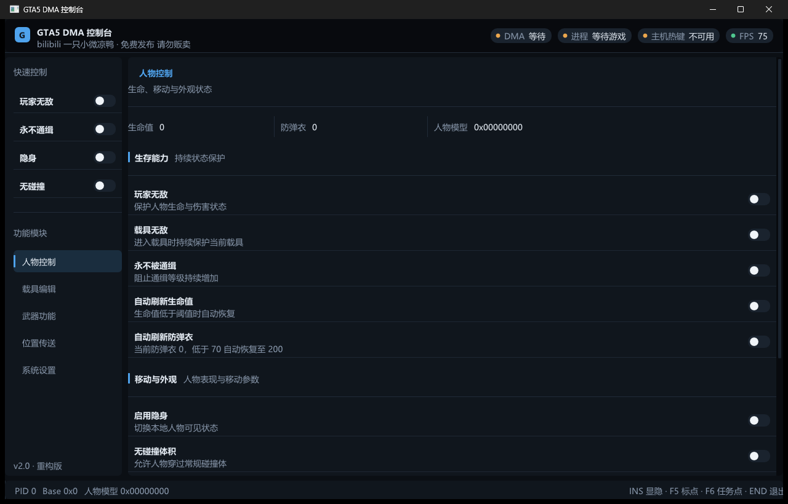

<div align="center">

# GTA5 DMA Control Console

[](https://github.com/fmc999/GTA5-DMA-Tool)
[](https://isocpp.org/)
[](https://github.com/ocornut/imgui)
[](https://github.com/ufrisk/MemProcFS)
[](https://github.com/fmc999/GTA5-DMA-Tool/actions/workflows/msbuild.yml)
[](LICENSE)

基于 C++23 / Dear ImGui / DirectX 11 / MemProcFS 构建的 GTA5 DMA 外部控制台，
支持 GTA5 原版与 GTA5 Enhanced 双进程自动识别。

**免费发布 · 请勿贩卖 · 仅供技术研究与 DMA 读写学习**

</div>

---

## 界面预览



单窗口控制台布局：页眉状态胶囊（DMA / 进程 / 主机热键 / FPS）、侧边栏快速控制与模块导航、
工作区分区内容、底部状态栏实时显示 PID / 基址 / 模型哈希。内置 4 套配色主题（午夜蓝 / 石墨灰 / 海洋青 / 绯红）。

## 功能

### 人物控制
- 玩家无敌与载具无敌（持续状态保护）
- 永不通缉、自动生命恢复、自动防弹衣刷新
- 隐身、无碰撞、速度控制（含野兽模式）
- 生命值 / 防弹衣锁定

### 载具编辑
- 载具 / 引擎 / 车身 / 油箱健康读取与修改
- 操控数据（加速、刹车、牵引、悬浮等）实时编辑
- 附加能力、降落伞、喷气、跳跃恢复
- 导弹锁定范围与有效距离、安全带

### 武器功能
- 当前武器属性读取（伤害 / 射速 / 射程 / 后坐力 / 精度）
- 无限弹药、无需装弹
- 冲击力修改、百万瞬击（子弹速度）

### 位置传送
- 自定义坐标与 60+ 预设位置（任务点位齐全）
- `F5` 传送到地图标记点 · `F6` 传送到任务点（Enhanced）
- 人物与载具状态自动处理（上车传送、高度修正）

### 界面与运行
- DMA 读写线程与 UI 线程分离，Scatter 批量读写降低 PCIe 带宽占用
- 主机及目标机双端热键检测
- 4 套主题实时切换

## 环境要求

### 硬件
- DMA / FPGA 设备（如 35T / 75T 板卡）
- 目标机：运行 GTA5 / GTA5 Enhanced 的 Windows 主机
- 控制机：运行本工具的 Windows 主机

### 开发环境
- Visual Studio 2022（或更高）+ Desktop development with C++ 工作负载
- Windows SDK（10.0+）
- C++23 语言标准（工程已配置）

> 仓库已内置 Dear ImGui 源码与 MemProcFS 头文件 / 导入库（`GTA5_DMA/MemProcFS/`）。

## 构建

<details>
<summary><b>命令行构建</b></summary>

```powershell
MSBuild.exe GTA5_DMA\GTA5_DMA.sln /t:Build /p:Configuration=Release /p:Platform=x64
```

产物：`GTA5_DMA/x64/Release/GTA5_DMA.exe`

</details>

<details>
<summary><b>Visual Studio</b></summary>

1. 打开 `GTA5_DMA/GTA5_DMA.sln`
2. 配置 `Release` / `x64`
3. 生成解决方案

</details>

<details open>
<summary><b>GitHub Actions（自动构建）</b></summary>

推送到 `main` 即自动触发 [MSBuild workflow](.github/workflows/msbuild.yml)，
构建产物发布在 Actions Artifacts。

</details>

## 使用

1. 确认 DMA 设备与 MemProcFS 驱动环境正常（`vmm.dll` / `leechcore.dll` 需与 exe 同目录或位于 `GTA5_DMA/MemProcFS/`）
2. 在目标主机启动 GTA5 或 GTA5 Enhanced
3. 在控制主机运行 `GTA5_DMA.exe`
4. 等待页眉状态胶囊显示 DMA 与游戏进程已连接
5. 通过左侧导航进入功能页面

### 快捷键

| 按键 | 功能 |
| --- | --- |
| `Insert` | 显示 / 隐藏控制台 |
| `F5` | 传送到地图标记点 |
| `F6` | 传送到任务点（Enhanced） |
| `End` | 退出程序 |

## 项目结构

```text
GTA5_DMA/
├── GTA5_DMA.sln                # 解决方案
├── GTA5_DMA/
│   ├── Core/                   # DMA 核心：初始化、内存后端、偏移、结构、输入
│   │   ├── DMA.*               # DMA 生命周期与指针链刷新（Scatter 批量读）
│   │   ├── MemoryBackend.*     # VMMDLL 封装：Read/Write/ScatterBatch (RAII)
│   │   ├── Offsets.h           # GTA5 / Enhanced 双版本偏移表
│   │   ├── Reclass.h           # ReClass.NET 导出的游戏结构定义
│   │   └── InputManager.*      # 目标机键盘状态读取（热键双端检测）
│   ├── Features/               # 功能模块（每个模块实现 OnDMAFrame()）
│   │   ├── GodMode / NoWanted / RefreshHealth / HealthManager / ArmorManager
│   │   ├── Invisibility / NoCollision / PlayerSpeed / Ragdoll
│   │   └── Teleport / VehicleEditor / WeaponInspector / Locations
│   ├── UI/                     # 界面层
│   │   ├── MyImGui.*           # DX11 + Win32 平台层（窗口 / 设备 / 主循环）
│   │   ├── ConsoleShell.*      # 单窗口布局：页眉 / 侧边栏 / 工作区 / 状态栏
│   │   ├── ConsoleTheme.*      # 主题系统 + 共享控件（ToggleRow / NavItem / StatPill）
│   │   └── MenuManager.*       # 页面状态与各页面内容
│   └── Attic/                  # 已停用功能（源码保留，便于恢复）
│       ├── TimeControl / HeistDividend / PlayerChaser / Dev
│       └── LegacyPages.cpp     # 停用功能的页面 UI 存档
├── ImGui/                      # Dear ImGui 1.91.8 源码
├── MemProcFS/                  # VMMDLL 头文件与导入库
tests/                          # 契约测试（PowerShell）+ 基础设施测试（C++）
docs/                           # 设计文档与截图
```

## 架构

```text
main.cpp
 ├─ UI 线程 ─── MyImGui::OnFrame ─── ConsoleShell::Render ─── 各功能页面
 └─ DMA 线程 ── DMA::DMAThreadEntry
                ├─ UpdateEssentials()    # Scatter 批量刷新指针链
                └─ 13 × Feature::OnDMAFrame()  # 各功能轮询读写
```

- **线程模型**：UI 与 DMA 读写完全分离，通过原子变量通信，无锁
- **内存访问**：统一走 `MemoryBackend`（VMMDLL 封装），关键路径使用 Scatter 批量读写
- **偏移管理**：`Offsets.h` 静态双版本表，进程识别后切换；远程特征码解析为可选测试组件（`Core/PatternScanner` + `Core/OffsetResolver`，仅测试工程编译）

## 测试

```powershell
# 契约测试（7 个）
Get-ChildItem tests/*.ps1 | ForEach-Object { powershell -File $_.FullName }

# 基础设施测试（PatternScanner / MemoryBackend / ArmorManager 纯逻辑断言）
msbuild tests\DmaInfrastructureTests.vcxproj /p:Configuration=Debug /p:Platform=x64
tests\x64\Debug\DmaInfrastructureTests.exe
```

## 偏移维护

游戏版本更新后优先检查（`GTA5_DMA/GTA5_DMA/Core/Offsets.h`）：

- `WorldPtr` / `GlobalPtr` / `BlipPtr` / `PlayerMgrPtr` / `AimCPedPtr`
- 人物、载具、武器结构字段（`Core/Reclass.h`）

修改偏移或结构后，先验证只读数据，再启用写入功能。

## 已知限制

- 时间控制、任务分红、追战局功能已停用（源码保留于 `Attic/`，导航入口注释，恢复方式见 `Attic/LegacyPages.cpp` 头注释）
- 无 BattlEye 主动绕过； Enhanced 在线模式行为不受本工具保证
- 偏移依赖特定游戏版本，更新后需人工校准

## 免责声明

- 本项目仅用于技术研究、软件开发与 DMA 读写学习
- 使用者应自行确认并遵守所在地区法律、游戏平台规则与服务条款
- 游戏更新后内存结构可能失效，错误偏移可能导致功能异常或目标进程崩溃
- 作者不对账号、硬件、数据或其他直接及间接损失负责

## 致谢

- [MemProcFS](https://github.com/ufrisk/MemProcFS) — DMA 内存访问框架
- [Dear ImGui](https://github.com/ocornut/imgui) — 立即模式 GUI
- [ReClass.NET](https://github.com/ReClassNET/ReClass.NET) — 内存结构逆向

## 许可

版权所有 © 2026 fmc999。免费发布，禁止商业使用与未经授权的修改分发，
详见 [LICENSE](LICENSE) / [LICENSE-zh-CN](LICENSE-zh-CN)。
