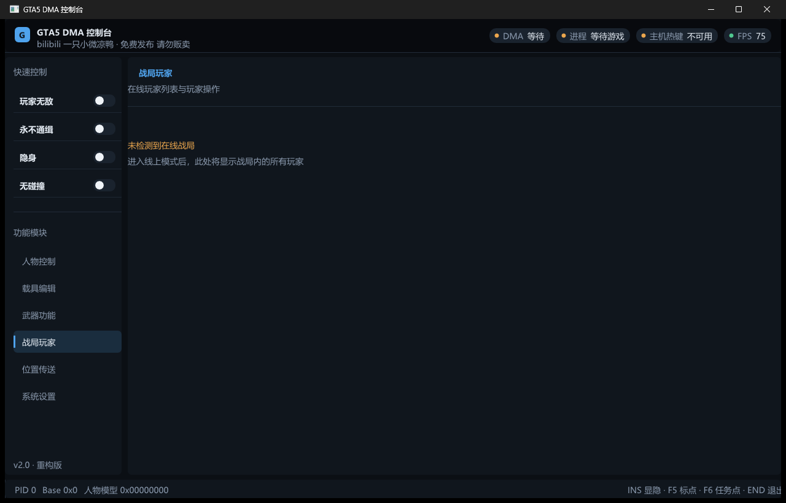

<div align="center">

# GTA5 DMA Control Console

[](https://github.com/fmc999/GTA5-DMA-CHEAT)
[](https://isocpp.org/)
[](https://github.com/ocornut/imgui)
[](https://github.com/ufrisk/MemProcFS)
[](https://github.com/fmc999/GTA5-DMA-CHEAT/actions/workflows/msbuild.yml)
[](LICENSE)
[](https://github.com/fmc999/GTA5-DMA-CHEAT/releases/latest)

基于 C++23 / Dear ImGui / DirectX 11 / MemProcFS 构建的 GTA5 DMA 外部控制台，支持 GTA5 原版与 GTA5 Enhanced 双进程自动识别。

A GTA5 external DMA control console built with C++23 / Dear ImGui / DirectX 11 / MemProcFS, with automatic detection of both legacy GTA5 and GTA5 Enhanced.

**免费发布 · 请勿贩卖 · 仅供技术研究与 DMA 读写学习**
**Free release · Do not resell · For technical research and DMA read/write learning only**

</div>

---

## 界面预览 | Screenshots




单窗口控制台布局：页眉状态胶囊（DMA / 进程 / 主机热键 / FPS）、可折叠侧边栏（快速控制 + 模块导航）、工作区分区内容、底部状态栏实时显示 PID / 基址 / 模型哈希。内置 4 套配色主题（午夜蓝 / 石墨灰 / 海洋青 / 绯红），位置大小与主题自动记忆。

Single-window console layout: header status pills (DMA / process / hotkeys / FPS), collapsible sidebar (quick toggles + module navigation), sectioned workspace, and a status bar showing PID / base address / model hash live. Four built-in color themes (Midnight / Graphite / Ocean / Crimson), with window geometry and theme auto-persisted.

## 功能 | Features

### 动态偏移解析 | Dynamic Offset Resolution ⭐
- 启动时特征码扫描 `.text` 段自动解析全部关键指针（10 条签名），游戏更新免改代码
- 主/备双特征码链，单条失配自动回退；失败时回落静态偏移表
- Runtime signature scanning of the `.text` section resolves all key pointers (10 signatures) at startup — no code changes needed after game updates, with primary/backup signature chains and static-offset fallback.

### 战局玩家 | Session Players ⭐
- YimMenuV2 加密 Ped 池扫描（`PoolEncryption` + rotl64 解密 → `fwBasePool` 迭代）
- 实时显示：名称 / RID / 等级 / 金钱 / RP / K/D / 血量 / 护甲 / 距离 / 载具状态 / 无敌 / 通缉
- 操作：传送到玩家（错开 2 米防卡模）、击杀（血量清零）
- 玩家加入/离开通知（默认关闭，设置页可开）；名字搜索过滤
- YimMenuV2 encrypted ped-pool scanning (`PoolEncryption` + rotl64 decrypt → `fwBasePool` iteration), live per-player name / RID / rank / money / RP / K-D / health / armor / distance / in-vehicle / god / wanted, teleport-to-player and kill actions, join/leave notifications (default off) and a name search filter.

### 战局载具 | Session Vehicles ⭐
- YimMenuV2 载具池（`fwVehiclePool`）实时扫描，50 米半径过滤
- 车名（24 款常用车型映射）/ 血量 / 距离；一键传送到身边（仅对静止载具有效）
- Live `fwVehiclePool` scanning with a 50 m radius filter; model name (24 common models mapped), health, distance; one-click teleport-to-player (stationary vehicles only).

### 人物控制 | Player
- 玩家无敌与载具无敌（持续状态保护）
- 永不通缉、自动生命恢复、自动防弹衣刷新
- 隐身、无碰撞、速度控制（含野兽模式）
- 生命值 / 防弹衣锁定
- Player & vehicle god mode, never-wanted, auto health/armor refresh, invisibility, no-collision, speed control, health/armor locking.

### 载具编辑 | Vehicle Editor
- 载具 / 引擎 / 车身 / 油箱健康读取与修改
- 操控数据（加速、刹车、牵引、悬浮等）实时编辑
- 附加能力、降落伞、喷气、跳跃恢复
- 导弹锁定范围与有效距离、安全带
- Vehicle / engine / body / tank health read & write, live handling-data editing, extras, parachute / jet / jump restore, missile lock range, seatbelt.

### 武器功能 | Weapons
- 当前武器属性读取（伤害 / 射速 / 射程 / 后坐力 / 精度）
- 无限弹药、无需装弹
- 冲击力修改、百万瞬击（子弹速度）
- Weapon stats readout (damage / fire rate / range / recoil / accuracy), infinite ammo, no-reload, impact and bullet-speed tuning.

### 位置传送 | Teleport
- 自定义坐标与 60+ 预设位置（任务点位齐全）
- `F5` 传送到地图标记点 · `F6` 传送到任务点（Enhanced）
- 人物与载具状态自动处理（上车传送、高度修正）
- Custom coordinates and 60+ preset locations (full mission coverage), `F5` waypoint / `F6` objective teleport (Enhanced), with vehicle-in/out and height correction handled automatically.

### 界面与运行 | UI & Runtime
- DMA 读写线程与 UI 线程分离，Scatter 批量读写降低 PCIe 带宽占用
- 主机及目标机双端热键检测
- Toast 操作反馈、窗口状态记忆、4 套主题实时切换
- Separate DMA / UI threads with scatter batch reads to reduce PCIe traffic, dual-end hotkeys (host + target), toast feedback, window state persistence, live theme switching.

## 环境要求 | Requirements

### 硬件 | Hardware
- DMA / FPGA 设备（如 35T / 75T 板卡）
- 目标机：运行 GTA5 / GTA5 Enhanced 的 Windows 主机
- 控制机：运行本工具的 Windows 主机
- A DMA / FPGA device (e.g. 35T / 75T boards), a target machine running GTA5 / GTA5 Enhanced, and a control machine running this tool.

### 开发环境 | Development
- Visual Studio 2022（或更高）+ Desktop development with C++ 工作负载 / *or newer, with the Desktop C++ workload*
- Windows SDK（10.0+）
- C++23 语言标准（工程已配置 / *already configured*）

> 仓库已内置 Dear ImGui 源码与 MemProcFS 头文件 / 导入库（`GTA5_DMA/MemProcFS/`）。
> Dear ImGui sources and MemProcFS headers / import libs are bundled (`GTA5_DMA/MemProcFS/`).

## 构建 | Build

<details>
<summary><b>命令行 | Command line</b></summary>

```powershell
MSBuild.exe GTA5_DMA\GTA5_DMA.sln /t:Build /p:Configuration=Release /p:Platform=x64
```

产物 | *Output*: `GTA5_DMA/x64/Release/GTA5_DMA.exe`

</details>

<details>
<summary><b>Visual Studio</b></summary>

1. 打开 `GTA5_DMA/GTA5_DMA.sln` / *Open the solution*
2. 配置 `Release` / `x64`
3. 生成解决方案 / *Build*

</details>

<details open>
<summary><b>GitHub Actions（自动构建 | CI build）</b></summary>

推送到 `main` 即自动触发 [MSBuild workflow](.github/workflows/msbuild.yml)，构建产物发布在 Actions Artifacts。

Pushing to `main` triggers the [MSBuild workflow](.github/workflows/msbuild.yml) automatically; artifacts are published under Actions Artifacts.

</details>

## 使用 | Usage

1. 确认 DMA 设备与 MemProcFS 驱动环境正常（`vmm.dll` / `leechcore.dll` 需与 exe 同目录或位于 `GTA5_DMA/MemProcFS/`）
2. 在目标主机启动 GTA5 或 GTA5 Enhanced
3. 在控制主机运行 `GTA5_DMA.exe`
4. 等待页眉状态胶囊显示 DMA 与游戏进程已连接
5. 通过左侧导航进入功能页面

*Ensure the DMA device and MemProcFS driver environment are ready (`vmm.dll` / `leechcore.dll` next to the exe). Start GTA5 / GTA5 Enhanced on the target machine, run `GTA5_DMA.exe` on the control machine, wait for the header pills to show DMA and game process connected, then navigate via the sidebar.*

### 快捷键 | Hotkeys

| 按键 | 功能 | Description |
| --- | --- | --- |
| `Insert` | 显示 / 隐藏控制台 | Show / hide the console |
| `F5` | 传送到地图标记点 | Teleport to map waypoint |
| `F6` | 传送到任务点（Enhanced） | Teleport to objective (Enhanced) |
| `End` | 退出程序 | Exit |

## 项目结构 | Project Structure

```text
GTA5_DMA/
├── GTA5_DMA.sln                # 解决方案
├── GTA5_DMA/
│   ├── Core/                   # DMA 核心：初始化、内存后端、偏移、结构、输入
│   │   ├── DMA.*               # DMA 生命周期与指针链刷新（Scatter 批量读）
│   │   ├── MemoryBackend.*     # VMMDLL 封装：Read/Write/ScatterBatch (RAII)
│   │   ├── Offsets.h           # GTA5 / Enhanced 双版本偏移表
│   │   ├── PatternScanner.*    # 特征码扫描（?/??/** 通配，rel32 解析）
│   │   ├── OffsetResolver.*    # 运行时偏移解析（主/备双特征码链）
│   │   ├── Reclass.h           # ReClass.NET 导出的游戏结构定义
│   │   └── InputManager.*      # 目标机键盘状态读取（热键双端检测）
│   ├── Features/               # 功能模块（每个模块实现 OnDMAFrame()）
│   │   ├── GodMode / NoWanted / RefreshHealth / HealthManager / ArmorManager
│   │   ├── Invisibility / NoCollision / PlayerSpeed / Ragdoll
│   │   ├── PlayerList          # 战局玩家（加密 Ped 池 + 统计 + 操作）
│   │   ├── VehicleList         # 战局载具（载具池扫描 + 传送）
│   │   └── Teleport / VehicleEditor / WeaponInspector / Locations
│   ├── UI/                     # 界面层
│   │   ├── MyImGui.*           # DX11 + Win32 平台层（窗口 / 设备 / 主循环）
│   │   ├── ConsoleShell.*      # 单窗口布局：页眉 / 可折叠侧边栏 / 工作区 / 状态栏
│   │   ├── ConsoleTheme.*      # 主题系统 + 共享控件（ToggleRow / NavItem / StatPill）
│   │   ├── UiToast.*           # Toast 操作反馈通知
│   │   ├── WindowState.*       # 窗口几何 / 主题 / 开关状态持久化
│   │   └── MenuManager.*       # 页面状态与各页面内容
│   └── Attic/                  # 已停用功能（源码保留，便于恢复）
│       ├── TimeControl / HeistDividend / PlayerChaser / Dev
│       └── LegacyPages.cpp     # 停用功能的页面 UI 存档
├── ImGui/                      # Dear ImGui 1.91.8 源码
├── MemProcFS/                  # VMMDLL 头文件与导入库
tests/                          # 契约测试（PowerShell）+ 基础设施测试（C++）
docs/                           # 设计文档与截图
```

## 架构 | Architecture

```text
main.cpp
 ├─ UI 线程 ─── MyImGui::OnFrame ─── ConsoleShell::Render ─── 各功能页面
 └─ DMA 线程 ── DMA::DMAThreadEntry
                ├─ ResolveRuntimeOffsets()  # 启动时特征码解析 10 条指针
                ├─ UpdateEssentials()       # Scatter 批量刷新指针链
                └─ 15 × Feature::OnDMAFrame()  # 各功能轮询读写
```

- **线程模型**：UI 与 DMA 读写完全分离，通过原子变量通信，无锁
- **内存访问**：统一走 `MemoryBackend`（VMMDLL 封装），关键路径使用 Scatter 批量读写
- **偏移管理**：启动时 `OffsetResolver` 特征码动态解析（主/备双链），失败回落 `Offsets.h` 静态双版本表
- **Threading**: UI and DMA threads are fully decoupled and communicate via atomics (lock-free). **Memory**: all access goes through `MemoryBackend` (VMMDLL wrapper) with scatter batches on hot paths. **Offsets**: resolved at startup by `OffsetResolver` (primary/backup signature chains) with static-table fallback.

## 测试 | Tests

```powershell
# 契约测试（7 个）
Get-ChildItem tests/*.ps1 | ForEach-Object { powershell -File $_.FullName }

# 基础设施测试（PatternScanner / MemoryBackend / OffsetResolver 纯逻辑断言）
msbuild tests\DmaInfrastructureTests.vcxproj /p:Configuration=Debug /p:Platform=x64
tests\x64\Debug\DmaInfrastructureTests.exe
```

## 偏移维护 | Offset Maintenance

动态解析失败时（日志出现 `kept static`），优先更新特征码（`Core/OffsetResolver.cpp` 目录）：
- `WorldPtr` / `GlobalPtr` / `BlipPtr` / `PlayerMgrPtr` / `AimCPedPtr` / `PedPoolPtr` / `VehiclePoolPtr` 等 10 条
- 人物、载具、武器结构字段（`Core/Reclass.h`）

修改偏移或结构后，先验证只读数据，再启用写入功能。

*If dynamic resolution fails (log shows `kept static`), update the signature catalog first (`Core/OffsetResolver.cpp`), then structure fields (`Core/Reclass.h`). Always verify read-only data before enabling write features.*

## 已知限制 | Known Limitations

- 时间控制、任务分红、追战局功能已停用（源码保留于 `Attic/`）
- 战局载具传送仅对静止载具有效（移动中载具导航位置会被物理引擎覆盖）
- 无 BattlEye 主动绕过；Enhanced 在线模式行为不受本工具保证
- Time control / heist dividend / session chaser are retired (sources kept in `Attic/`). Session-vehicle teleport only works on stationary vehicles (physics overrides navigation on moving ones). No active BattlEye bypass; Enhanced online behavior is not guaranteed.

## 免责声明 | Disclaimer

- 本项目仅用于技术研究、软件开发与 DMA 读写学习
- 使用者应自行确认并遵守所在地区法律、游戏平台规则与服务条款
- 游戏更新后内存结构可能失效，错误偏移可能导致功能异常或目标进程崩溃
- 作者不对账号、硬件、数据或其他直接及间接损失负责

*This project is for technical research, software development, and DMA read/write learning only. Users are responsible for complying with local laws and platform terms of service. Game updates may invalidate memory layouts; incorrect offsets can cause crashes or misbehavior. The author is not liable for any account, hardware, data, direct or indirect losses.*

## 致谢 | Acknowledgements

- [MemProcFS](https://github.com/ufrisk/MemProcFS) — DMA 内存访问框架
- [Dear ImGui](https://github.com/ocornut/imgui) — 立即模式 GUI
- [ReClass.NET](https://github.com/ReClassNET/ReClass.NET) — 内存结构逆向
- [YimMenuV2](https://github.com/YimMenu/YimMenuV2) — 加密池与结构参考

## 许可 | License

版权所有 © 2026 fmc999。免费发布，禁止商业使用与未经授权的修改分发，
详见 [LICENSE](LICENSE) / [LICENSE-zh-CN](LICENSE-zh-CN)。

*Copyright © 2026 fmc999. Free release; commercial use and unauthorized modification/redistribution are prohibited. See [LICENSE](LICENSE) / [LICENSE-zh-CN](LICENSE-zh-CN).*
